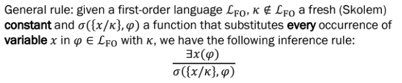

### Satisfiability, unsatisfiability, validity

A formula ψ is **satisfiable** if $\exists$ some structure S and some assignment α such that **(S, α) ⊨ ψ**

A formula ψ is **valid** if, $\forall$ structure S and assignment α, **(S, α) ⊨ ψ** $\rightarrow$ tautology

### Logical equivalences in FOL - $\exists$, $\forall$ 

### $\forall$ elimination

### Skolemization - $\exists$ elimination

This is done via the **Skolem function** $\theta$, which takes variables in the scope of $\exists$ , i.e., bound by it, as parameters

----------------

### Propositionalization - from FOL to PL

The objective is to proceed as follows:

1. remove ∃’s by skolemization
2. omit ∀ as only the variables in the scope of ∀ remain

What remains resembles a formula in propositional logic! So:
1. turn formulae in CNF
2. apply inference mechanisms that are suitable for propositional logic

------------------

#### NNF in FOL

1. Occurrences of $\neg$ are only in front of atomic formulae, i.e., **push inwards**
2. There aren't any → and/or ↔

#### CNF in FOL

The same as PL, having a **quantifier-free formula**

-------------

### Prenex form

#### PCNF - Prenex CNF

page 15 slides 18